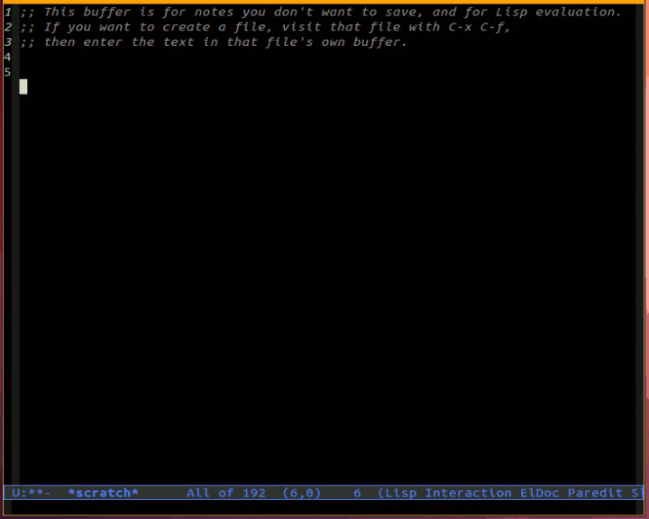

A package for Emacs that let's you highlight a s-exp when eval'ing it.

Similar to the effect obtained in Slime when pressing C-c C-c on a
s-exp.

# Installation #

To install place the file `flash-eval.el` somewhere in your load-path
and add the following to your .emacs:

```lisp
(require 'flash-eval)

(add-hook 'emacs-lisp-mode-hook (lambda ()
                                 (local-set-key (kbd "C-c C-c") #'flash-eval-eval-defun-flash)))

;; For the *scratch* buffer
(add-hook 'lisp-interaction-mode-hook (lambda ()
                                       (local-set-key (kbd "C-c C-c") #'flash-eval-eval-defun-flash)))

```

# Screencast #


